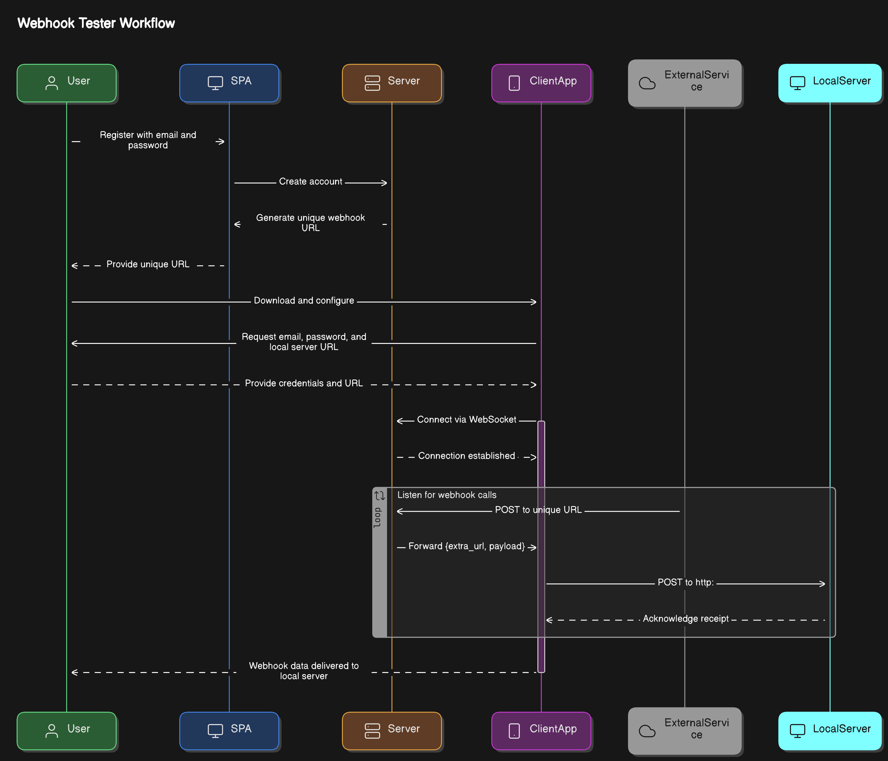

# Webhook Tester

Webhook Tester is a tool that allows developers to test webhook integrations on their local servers during development, as if the server was already deployed. It creates a bridge between external webhook calls and a developer's local server, making it easier to simulate real-world webhook behavior.

## Table of Contents

-   [Features](#features)
-   [How It Works](#how-it-works)
-   [Installation](#installation)
-   [Usage](#usage)
-   [Security Considerations](#security-considerations)
-   [Contributing](#contributing)
-   [Repositories](#project-repositories)
-   [License](#license)

## Features

-   Simulates webhook requests to local servers during development
-   Real-time data transmission via WebSocket connection
-   Automatically appends URL paths and payloads to local server requests
-   Easy setup with unique webhook URLs for each user
-   Supports multiple webhook test cases
-   Logs webhook payloads for easy debugging

## How It Works

1. **Create an account**: Users sign up via the Single Page Application (SPA) at webhook.eduarte.pro using their email and password.

2. **Unique Webhook URL**: After registration, each user is provided with a unique webhook URL in the following format: `https://webhook.eduarte.pro/unique-uuid`

3. **Download the Client App**: The client app establishes a WebSocket connection with the server. Users will provide the email, password, and the URL of the local server (e.g., http://localhost:3000) where they want to forward webhook data.

4. **Bridge the Webhook**: Once the WebSocket connection is established, any POST request made to the unique webhook URL will be forwarded to the client app.

5. **Forward the Webhook**: The client app then forwards the received webhook payload and appends any extra URL segments (if applicable) to the local server URL, sending it as a POST request.

For example:

-   Webhook sent to: `https://webhook.eduarte.pro/unique-uuid/extra_path`
-   Will be forwarded to: `http://localhost:3000/extra_path` with the original payload.

### Here is a visual diagram of how it works:



## Installation

### Prerequisites

-   bun, you can find bun at https://bun.sh/

1. Clone the client repository at https://github.com/EduartePaiva/webhook-tester-client

2. run the following commands

```console
cd webhook-tester-client
bun install
bun index.ts
```

## Usage

### 1. Sign up and get your webhook URL

-   Go to https://webhook.eduarte.pro and create an account. Once signed in, you'll get a unique webhook URL.

### 2. Download the client app

-   Install the client app locally and follow the instructions to connect it with your local server.

### 3. Receive webhook events

-   Send test webhook events to your unique URL, and the client app will forward the requests to your local development server.

## Contributing

Contributions are welcome! To get started:

1. Fork any of the project repositories.
2. Create a new branch for your feature or bug fix.
3. Submit a pull request with a detailed description of your changes.

## Project repositories

-   Server code, it's this current repository.
-   Client code: https://github.com/EduartePaiva/webhook-tester-client
-   Webapp SPA code: https://github.com/EduartePaiva/webhook-tester-homepage

## License

This project is licensed under the MIT License. See the [LICENSE](LICENSE) file for more details.
